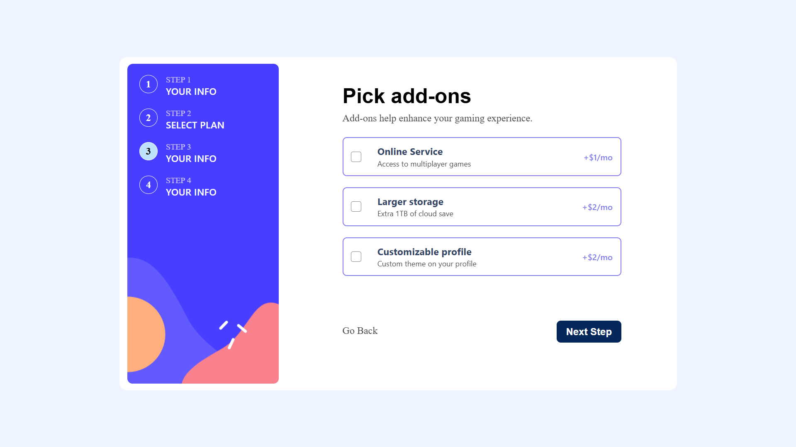
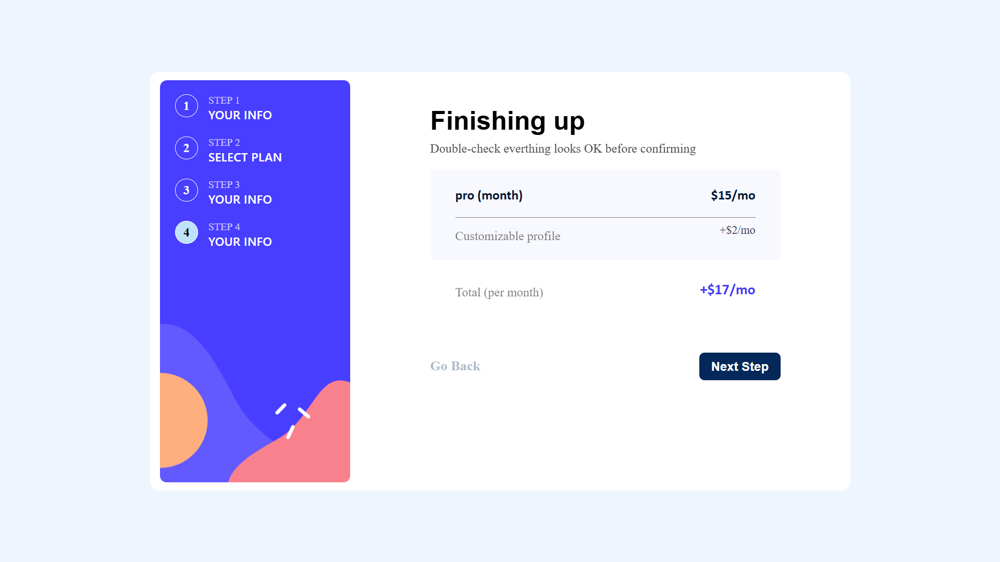
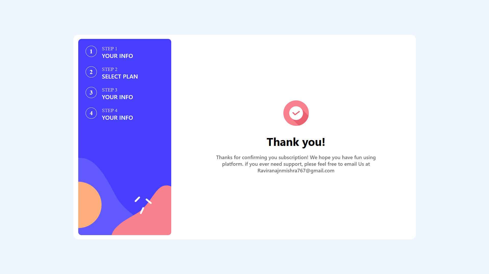

# Multi-Step Form Web Application

A responsive multi-step form with validation, plan selection, add-ons, summary, and a thank-you page.
This project demonstrates **JavaScript form handling, dynamic UI updates, and responsive design** using **HTML, CSS, and Vanilla JavaScript**.

---

## 🚀 Live Demo

👉 [Click here to view the project](https://raviranjanmishra01.github.io/HTML-CSS-AND-JS_projects/02-Multi-page-calculater/)

---
---

## 📸 Screenshots

### Step 1: Personal Info


### Step 2: Plan Selection


### Step 3: Add-ons



### Step 4: Summary



### Final Page



---

## ✨ Features

* **Step-based navigation** (with progress circles)
* **Form validation** (name, email, phone number)
* **Plan selection** (monthly/yearly toggle)
* **Add-ons** selection with real-time price calculation
* **Responsive design** (desktop + mobile optimized)
* **Final summary** with calculated total price
* **Thank-you page** after submission

---

## 🛠️ Tech Stack

* **HTML5** – Structure
* **CSS3** – Styling & responsive design
* **JavaScript (Vanilla JS)** – Logic & interactivity

---

## 📂 Project Structure

```
📦 multipages-web-page
 ┣ 📂 assets
 ┃ ┗ 📂 images
 ┃     ┣ icon-arcade.svg
 ┃     ┣ icon-advanced.svg
 ┃     ┣ icon-pro.svg
 ┃     ┣ icon-checkmark.svg
 ┃     ┗ icon-thank-you.svg
 ┣ 📜 index.html
 ┣ 📜 style.css
 ┣ 📜 script.js
 ┗ 📜 README.md
```

---

## ⚡ How It Works

1. **Step 1:** User fills personal info → validated with regex & length checks.
2. **Step 2:** User selects a plan (monthly/yearly).
3. **Step 3:** User picks optional add-ons.
4. **Step 4:** Final summary → dynamically calculates total price.
5. **Finish:** Thank-you page displayed.


Open in browser:

```bash
open index.html
```

---

## 📝 License

This project is licensed under the MIT License – feel free to use and modify.

---

💡 *Made with ❤️ by [Raviranjan kumar](https://github.com/RaviranjanMishra01)*
