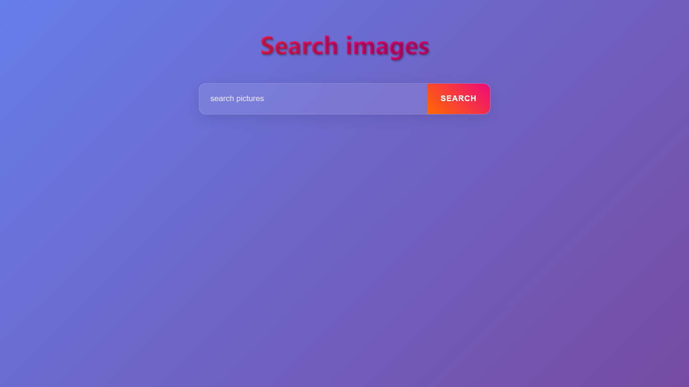
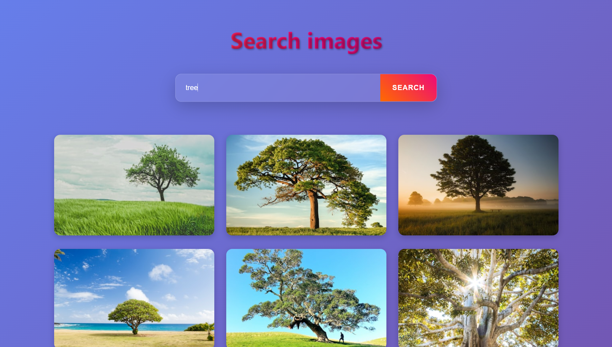
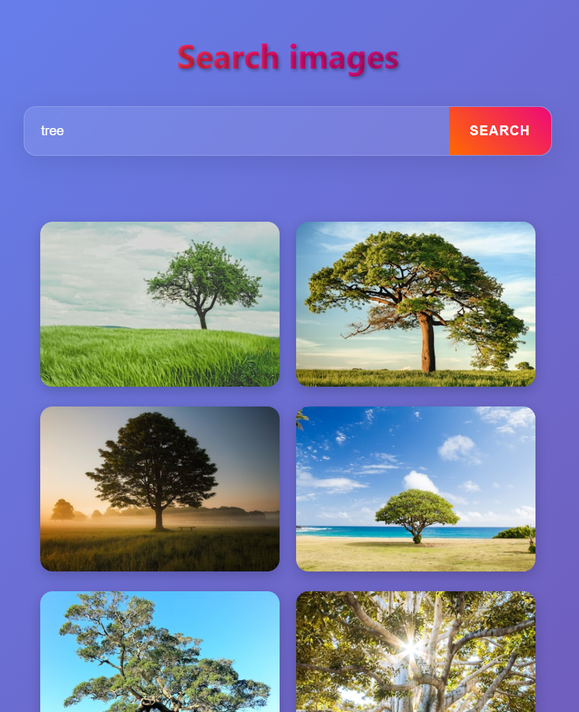
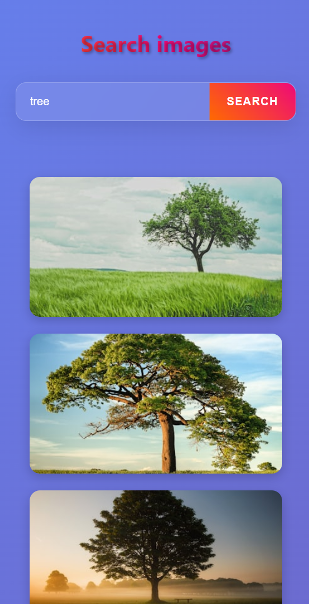

# Image Search Web App 🌄

A sleek, responsive, and modern web application to **search and display images** using the **Unsplash API**. Users can type a keyword, search for images, and load more results dynamically.

---
# 📸 Desktop Preview




# 📸 tab Preview


# 📸 phone Preview



---

## Features ✨

- **Responsive Design:** Works on desktop, tablet, and mobile devices.
- **Animated Gradient Background:** Smooth, eye-catching animated gradient.
- **Live Image Search:** Fetch images from Unsplash based on user input.
- **Load More Functionality:** Fetch additional results without refreshing the page.
- **Hover Effects:** Interactive image hover effects with smooth animations.
- **Accessible Links:** Each image links to its Unsplash page in a new tab.

---

## 🚀 Live Demo

👉 [Click here to view the project](https://raviranjanmishra01.github.io/HTML-CSS-AND-JS_projects/03-GradientGallery/)

---

---

## 🛠️ Tech Stack

* **HTML5** – Structure
* **CSS3** – Styling & responsive design
* **JavaScript (Vanilla JS)** – Logic & interactivity
* **Unsplash API** – Image search and retrieval.
---

## File Structure 📁
```git

bash
image-search-app/
│
├── index.html      # Main HTML page
├── style.css       # Styling and animations
├── script.js       # JS logic for fetching and displaying images
└── README.md       # Project documentation
```
## Contributing 🤝
> Feel free to submit issues or pull requests. Suggestions for improving the UI/UX are welcome!

## License 📄
This project is MIT licensed.
See the LICENSE file for details.

💡 *Made with ❤️ by [Raviranjan kumar](https://github.com/RaviranjanMishra01)*
