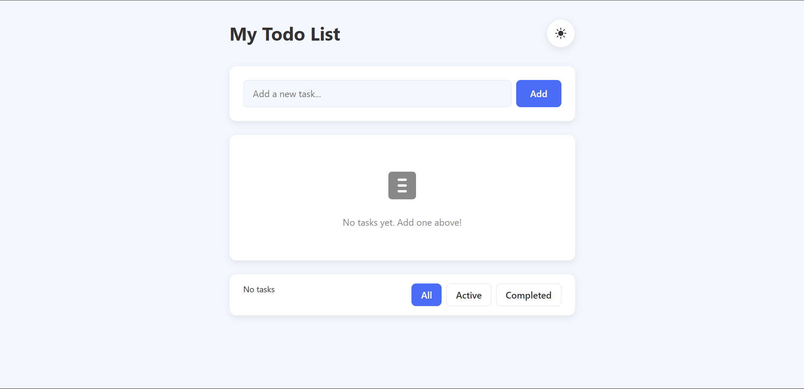
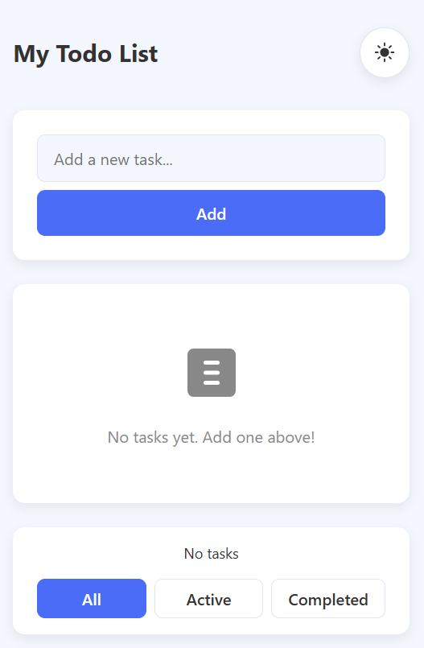

# 🌙 Responsive Todo App (HTML, CSS, JavaScript)

A **simple, modern, and fully functional Todo App** built using only HTML, CSS, and Vanilla JavaScript.  
It supports **light/dark themes**, **add/edit/delete todos**, **mark as complete**, and **filtering** between *All*, *Active*, and *Completed* tasks — all stored in **LocalStorage**.

# 📸 Preview
👉 [Click here to view the project](https://raviranjanmishra01.github.io/HTML-CSS-AND-JS_projects/04-TO-DO-APK/)
## 📸 Desktop Preview




## 📸 phone Preview

---

## ✨ Features
- ✅ Add new todos  
- ✏️ Edit existing todos (double-click or click edit)  
- 🗑️ Delete todos  
- 🌗 Light/Dark theme toggle (saved automatically)  
- 🎯 Filter: All / Active / Completed  
- 🧹 Clear completed tasks  
- 💾 LocalStorage persistence  
- 📱 Fully responsive design  

---

## 🛠️ Tech Stack
- **HTML5**
- **CSS3 (custom properties + responsive design)**
- **Vanilla JavaScript (ES6)**  
- No libraries or frameworks needed.

---

## 🚀 How to Run
1. Download or clone this repository:
   ```bash
   git clone https://github.com/your-username/responsive-todo-app.git
Open the folder and double-click index.html.

Start adding your tasks!


💡 Author
Ravi Mishra
Learning MERN Stack | Passionate Web Developer 🌐

