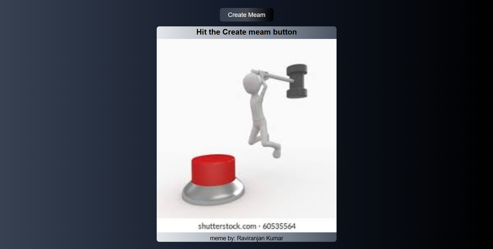

# 🎭 Meme Generator App

A simple **Meme Generator** web app built using **HTML, CSS, and JavaScript**, that fetches random memes from the **Meme API** and displays them dynamically on the page.

---
# 📸 Preview
👉 [Click here to view the project](https://raviranjanmishra01.github.io/HTML-CSS-AND-JS_projects/05-API-MEME/)
---

## 🖼️ Preview



## 🚀 Features

- Fetches fresh random memes using the **Meme API**  
- Displays meme **title**, **image**, and **author**  
- Responsive and clean **UI design** with gradient backgrounds  
- One-click button to generate a new meme instantly  

---

## 🧠 Technologies Used

| Technology | Purpose |
|-------------|----------|
| **HTML5** | Structure of the webpage |
| **CSS3** | Styling and gradient design |
| **JavaScript (ES6)** | Fetch API integration and DOM manipulation |
| **Meme API** | Source of random memes (`https://meme-api.com/`) |


---

## 📂 Project Structure

```text
meme-generator/
│
├── index.html        # Main HTML file
├── style.css         # Stylesheet with gradient UI
├── scrpit.js         # JavaScript logic for fetching and displaying memes
└── assets/
    └── hit.png       # Default placeholder meme image
```

## 💡 *Made with ❤️ by [Raviranjan kumar](https://github.com/RaviranjanMishra01)*
