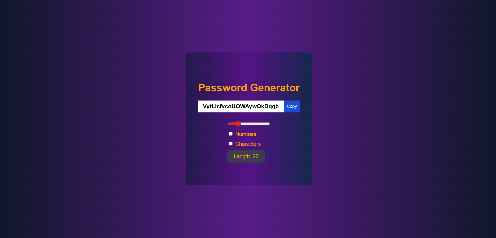

# 🔐 Password Generator

A simple and responsive Password Generator built using HTML, CSS, and JavaScript.
It allows users to quickly generate strong passwords with adjustable length and options for including numbers and special characters. It also includes a one-click copy feature.

# 📸 Preview
👉 [Click here to view the project](https://raviranjanmishra01.github.io/HTML-CSS-AND-JS_projects/06-Password-Generator/)

## 📷 UI Preview
Password Generator  
 

## 🚀 Features

- ✅ Generate secure passwords instantly
- ✅ Adjustable length (6 to 100 characters)
- ✅ Include/exclude numbers
- ✅ Include/exclude special characters
- ✅ One-click clipboard copy
- ✅ Fully responsive UI
- ✅ Clean gradient UI design

## 📌 Technologies Used

> HTML5

> CSS3

> JavaScript (ES6)


⚙️ How It Works
```js
1. The script updates the password in real-time whenever:

2. The slider changes

3. The Numbers checkbox changes

4. The Characters checkbox changes

Password is generated by selecting random characters from a dynamic character set.

```

## Author 
> Raviranjan kumar ❤️